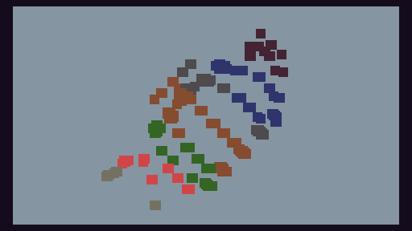

# tic80-quarternion

Inspiration from [p3d](https://github.com/nesbox/TIC-80/blob/master/demos/p3d.tic) by Filippo. 

[Quarternion lecture](https://www.youtube.com/watch?v=d4EgbgTm0Bg) by 3b1b.

[Coordinates](https://github.com/dasch/graphics/blob/master/data/teapot.data) of the Utah teapot by dasch.
